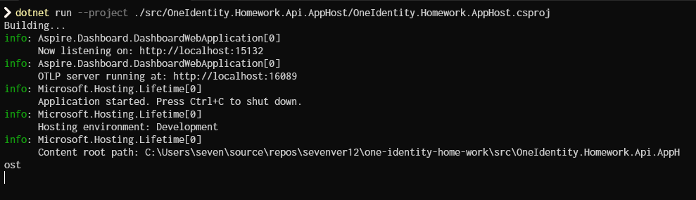
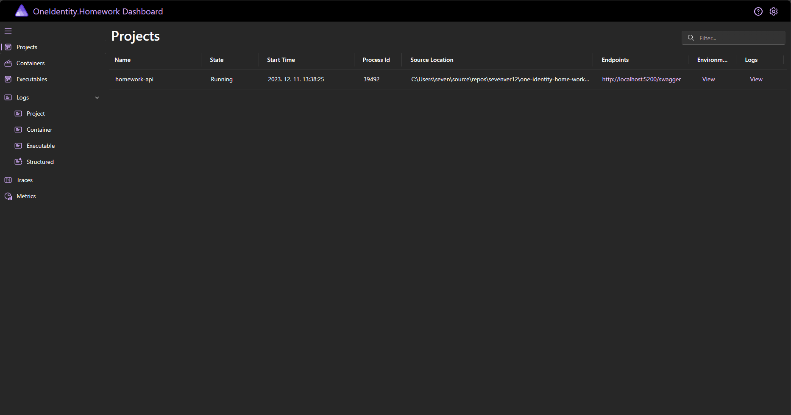
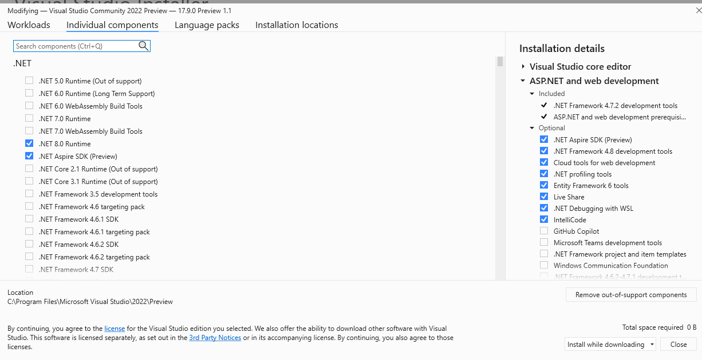
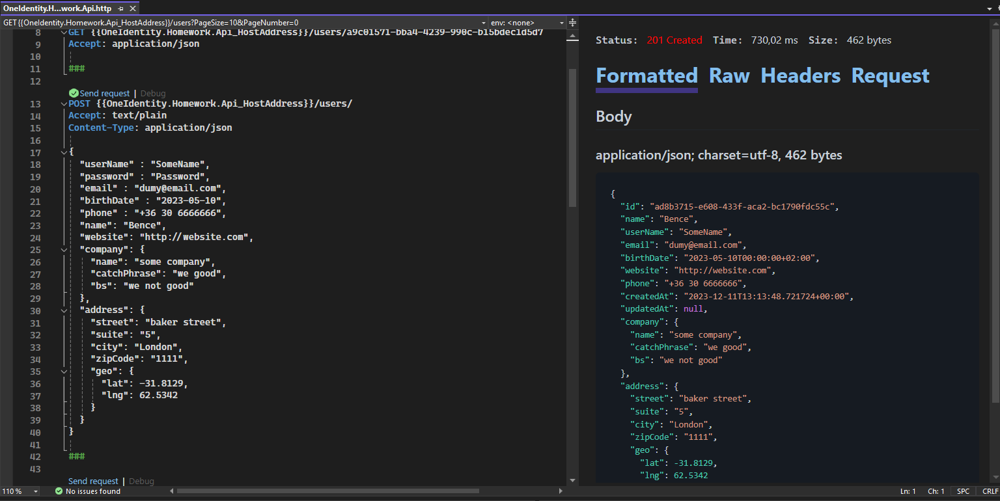

[](https://github.com/sevenver12/one-identity-home-work/actions/workflows/build.yml)
[](https://sonarcloud.io/summary/new_code?id=sevenver12_one-identity-home-work)
[](https://sonarcloud.io/summary/new_code?id=sevenver12_one-identity-home-work)
[](https://sonarcloud.io/summary/new_code?id=sevenver12_one-identity-home-work)
[](https://sonarcloud.io/summary/new_code?id=sevenver12_one-identity-home-work)
[](https://sonarcloud.io/summary/new_code?id=sevenver12_one-identity-home-work)


# Prerequisites

To run the project: .net 8 is required to run this project
For integration tests: Docker is required


# Running the application 

## Cli

To run this project the intended way Aspire needs to be set up.
This can be achieved by the following cli command
``` bash
dotnet workload install aspire
```

Then from the solution directory run the following command:

```bash
dotnet run --project ./src/OneIdentity.Homework.Api.AppHost/OneIdentity.Homework.AppHost.csproj
```



Application should be running, should be listening to http://localhost:15132/



From this landing page on the left side there are many metrics, and traces that can be found as well as structured logging, but to access the swagger  navigate to Projects, then in the Endpoints column click on http://localhost/5200/swagger

## Visual studio

To load the solution in visual studio (in this point in time) a preview version of VS is needed, 17.9.0 Preview 1.1

Then in the VS installer or in CLI the Aspire workload needs to be installed.

In cli: 
``` bash
dotnet workload install aspire
```

In VS installer: 


The solution can be Opened with these steps.

From here ether select the OneIdentity.Homework.AppHost project (under the Aspire project folder) or the OneIdentity.Homework.Api as a startup project.

In the OneIdentity.Homework.Api two launch profiles can be found, `http` launches the application locally, and `docker` launches it in docker

OneIdentity.Homework.AppHost launches the application alongside with mongodb (docker needs to be running for this one).


## Testing endpoints

Inside of the OneIdentity.Homework.Api project can be found a OneIdentity.Homework.Api.http

Run the application and click on the little `Send request` text above an endpoint to test is



## Tests

[Last test run can be found here](https://github.com/sevenver12/one-identity-home-work/actions/runs/7168016762/job/19515344125)

[Sonar analysis](https://sonarcloud.io/project/overview?id=sevenver12_one-identity-home-work)


## Remarks

This repository is made by Bence Szalma for One Identity for the homework part of the interview process